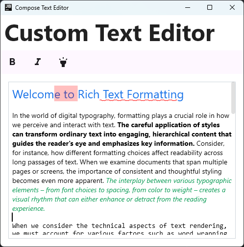

# Compose Text Editor

![badge-jvm] ![badge-android] ![badge-wasm] ![badge-ios]

Compose has been missing a **Rich Text Editor** since its inception.
I've [taken a crack](https://github.com/Wavesonics/richtext-compose-multiplatform) at this
previously, as have [others](https://github.com/MohamedRejeb/Compose-Rich-Editor).

However, they have all suffered from fundamental limitations in `BasicTextField`, the foundation of
all text entry in Compose.

This project is an attempt to re-implement text entry from scratch to finally have a
solution to the various problems.faw

### Why?

I've been trying to implement a [spell checking](https://github.com/Wavesonics/SymSpellKt) text
field in Compose, and keep running up against
the limitations of `BasicTextField`. Pretty much out of options, I decided to see what it might take
to replace `BasicTextField` with something that solved all of my needs.

And now, it's working, and at this point, working pretty well.

It's probably not a permanent solution.
`BasicTextField2`'s new state based approach and gap-buffer has reach maturity and includes a lot of what I would need
to replace this, but still cannot handle rich text rendering. So until that is solved, this is the only solution
that I am aware of that ticks every box:

- ✅ 100% Compose Multiplatform
- ✅ Efficient rendering and editing of long-form text
- ✅ Rich text with custom spans
- ✅ Expose scroll state
- ✅ Spell checking

You can [Give it a try here](https://wavesonics.github.io/ComposeTextEditorLibrary/).

### Features:

- Rich text rendering and editable
  - Semi-efficient rendering for long form text (_only renders what is visible_)
  - Semi-efficient data structure for text storage & editing. (_but not nearly as efficient as the
    Gap Buffer BTF2 uses under the hood_)
- Cursor movement, clicking, keyboard short cuts, ect
- Text selection (_highlighting and edit ops_)
- copy/cut/paste
- Exposed scroll state, so we can render scroll bars (_BTF1 can't do this_)
- Doesn't copy and return full contents on each edit, so again better for longer form text. (_BTF2
  also works this way, but BTF2 doesn't support AnnotatedString for rich content_)
- Support custom Rich Span drawing (_this allows us to render the traditional Spell Check red
  squiggle_)
- Emits edit events: so if a single character is inserted, you can collect a Flow, and know exactly
  what change was made. This makes managing Spell Check much more efficient as you can just
  respell-check the single word that was changed, rather than everything. (_BTF2 now finally offers this!_)
- Find & Replace UI: Works exactly as you'd expect.

#### Platforms

All of the platforms supported by Compose Text Editor are now supported.

### Work left to do:

- Copy/Paste of rich text always strips the formatting (_this is a Compose MP bug_)
- Right-to-Left text is probably broken
- Sentence level spell checking is not working as expected

## Want to try it?

Text Editor:

`implementation("com.darkrockstudios:composetexteditor:1.5.0")`

Spell Checking addon:

`implementation("com.darkrockstudios:composetexteditor-spellcheck:1.5.0")`

Find & Replace addon:

`implementation("com.darkrockstudios:composetexteditor-find:1.5.0")`

[badge-android]: http://img.shields.io/badge/-android-6EDB8D.svg?style=flat

[badge-jvm]: http://img.shields.io/badge/-jvm-DB413D.svg?style=flat

[badge-js]: http://img.shields.io/badge/-js-F8DB5D.svg?style=flat

[badge-js-ir]: https://img.shields.io/badge/support-[IR]-AAC4E0.svg?style=flat

[badge-linux]: http://img.shields.io/badge/-linux-2D3F6C.svg?style=flat

[badge-windows]: http://img.shields.io/badge/-windows-4D76CD.svg?style=flat

[badge-wasm]: https://img.shields.io/badge/-wasm-624FE8.svg?style=flat

[badge-wasmi]: https://img.shields.io/badge/-wasi-626FFF.svg?style=flat

[badge-jsir]: https://img.shields.io/badge/-js(IR)-22D655.svg?style=flat

[badge-apple-silicon]: http://img.shields.io/badge/support-[AppleSilicon]-43BBFF.svg?style=flat

[badge-ios]: http://img.shields.io/badge/-ios-CDCDCD.svg?style=flat

[badge-ios-sim]: http://img.shields.io/badge/-iosSim-AFAFAF.svg?style=flat

[badge-mac-arm]: http://img.shields.io/badge/-macosArm-444444.svg?style=flat

[badge-mac-x86]: http://img.shields.io/badge/-macosX86-111111.svg?style=flat

[badge-watchos]: http://img.shields.io/badge/-watchos-C0C0C0.svg?style=flat

[badge-tvos]: http://img.shields.io/badge/-tvos-808080.svg?style=flat
